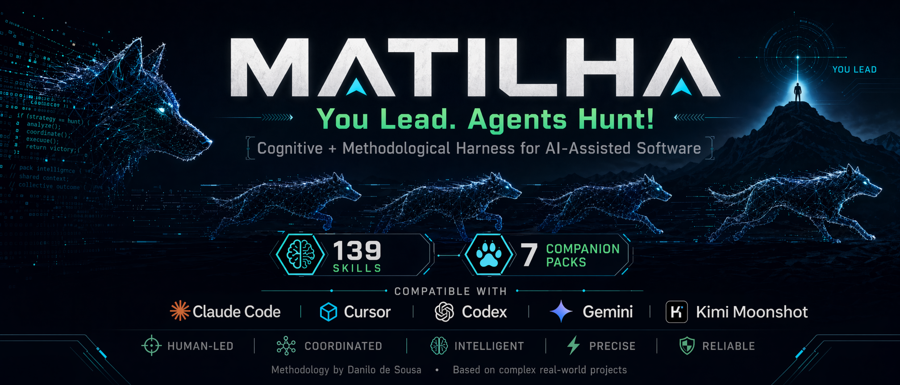

<!--
matilha — cognitive + methodological harness for AI-assisted software development.
Keywords: agent orchestration, multi-agent systems, context engineering, agentic patterns,
prompt engineering, Anthropic harness, Karpathy LLM wiki, Claude Code plugin, Cursor,
Codex CLI, Gemini CLI, skills, composition layer, methodology harness, AI-ops,
LGPD, NFRs, system design, UX psychology, growth strategy, JTBD, AARRR,
Hexagonal architecture, Domain-Driven Design, bounded contexts, event sourcing,
software engineering discipline, KISS, clean code, LLM OS, agent methodology.
-->

<p align="center">
  
</p>

# matilha

> **You lead. Agents hunt.**
> A cognitive + methodological harness for multi-week AI-assisted software development.

[](https://www.npmjs.com/package/matilha)
[](#-architecture-highlights)
[](./LICENSE)
[](#-the-ecosystem-7-packs-139-skills)
[](#-install-on-a-new-machine-one-copy-paste)

**139 skills. 7 companion packs. Composition layer. SessionStart activation.** Cross-tool across Claude Code, Cursor, Codex CLI, and Gemini CLI. Methodology wraps craft — **you keep the decision seat, agents carry the execution.**

> [!IMPORTANT]
> **Matilha is not a theoretical framework.** The methodology was distilled from shipping **Gravicode**, **CNH Pass**, **Sinapise**, **Speechia**, and **Argos** — real projects where AI agents are the primary execution surface and discipline decides whether a multi-week build ships on time.

### How matilha thinks

```
    USER PROMPT (any software-construction intent)
              │
              ▼
    ┌─────────────────────────────┐
    │  1. DETECT                  │  SessionStart hook injects
    │     matilha priority active │  activation priority at session start
    └─────────────────────────────┘
              │
              ▼
    ┌─────────────────────────────┐
    │  2. ROUTE                   │  matilha-compose classifies intent
    │     phase OR creative       │  → phase skill (scout/plan/design/...)
    └─────────────────────────────┘  OR → superpowers:brainstorming
              │                         with pack-aware preamble
              ▼
    ┌─────────────────────────────┐
    │  3. ENRICH                  │  Companion packs (ux / growth /
    │     domain expertise woven  │  harness / sysdesign / sweng /
    └─────────────────────────────┘  swarch / swsec) surface skills by
              │                         name during exploration.
              ▼
    ┌─────────────────────────────┐
    │  4. EXECUTE                 │  Superpowers handles craft
    │     you lead, agents hunt   │  (brainstorming, writing-plans, TDD).
    └─────────────────────────────┘  Matilha tracks phase + state.
```

> 🏠 **Official entry point.** This is the canonical repository for the matilha ecosystem. The 7 companion packs + CLI are satellites — this hub has the install guide, docs, and rules.

---

## ⚡ What you get in 2 minutes

| | |
|---|---|
| 🐺 **Methodology always on** | Every software-construction prompt routes through matilha first — phase awareness, state tracking, lazy bootstrap. No `matilha-init` required. |
| 📚 **139 curated skills** | 22 UX (Weinschenk/Krug) + 20 growth (AARRR/JTBD) + 22 agent-harness (Anthropic/OpenAI) + 19 system design (Tan) + 15 engineering discipline + 17 architecture + 13 AI-ops security. |
| 🎭 **Storytelling activation** | When matilha fires, you see an atmospheric sigil mirroring your domain language — *"The pack sensed familiar territory: Lambda / EventBridge / DynamoDB"*. Recognition aha moment, then brainstorming runs enriched. The sigil adapts to your language — Portuguese, English, or whichever vocabulary you use in the prompt. |

---

## 🚀 Install

There are three paths. Pick the one that fits you.

---

### Path A — Via npm (recommended)

**1.** Install the CLI and run the interactive picker:

```bash
npm install -g matilha
matilha install-plugins
```

The picker asks which packs you want (presets or custom multiselect), whether to write CLAUDE.md, and copies the install block to clipboard — or add `--deep` to skip the paste entirely:

```bash
matilha install-plugins --deep
```

**Install everything non-interactively** (core + all 7 packs + CLAUDE.md):

```bash
matilha install-plugins --full --deep --with-claudemd
```

**2.** Open Claude Code and run:

```
/reload-plugins
```

Done. Type any software prompt and the sigil appears.

---

### Path B — Wizard inside Claude Code (no npm needed)

**1.** Install the core plugin:

```
/plugin marketplace add danilods/matilha-skills
/plugin install matilha@matilha-skills --user
```

**2.** In any Claude Code session, run the install wizard:

```
/matilha-install
```

The wizard asks which packs you want, then runs `claude plugin install` for each one automatically. At the end it offers to write the CLAUDE.md activation snippet.

> **Why two steps?** The Claude Code marketplace has no dependency system — installing `matilha-skills` does not auto-install the companion packs. The wizard is the zero-npm solution to close that gap.

---

### Path C — Manual paste block

If you prefer full control, paste the commands one by one inside Claude Code:

```
/plugin marketplace add danilods/matilha-skills
/plugin install matilha@matilha-skills --user

/plugin marketplace add danilods/matilha-ux-pack
/plugin install matilha-ux-pack@matilha-ux-pack --user

/plugin marketplace add danilods/matilha-growth-pack
/plugin install matilha-growth-pack@matilha-growth-pack --user

/plugin marketplace add danilods/matilha-harness-pack
/plugin install matilha-harness-pack@matilha-harness-pack --user

/plugin marketplace add danilods/matilha-sysdesign-pack
/plugin install matilha-sysdesign-pack@matilha-sysdesign-pack --user

/plugin marketplace add danilods/matilha-software-eng-pack
/plugin install matilha-software-eng-pack@matilha-software-eng-pack --user

/plugin marketplace add danilods/matilha-software-arch-pack
/plugin install matilha-software-arch-pack@matilha-software-arch-pack --user

/plugin marketplace add danilods/matilha-security-pack
/plugin install matilha-security-pack@matilha-security-pack --user
```

Verify with `/plugin list` → all 8 should be **enabled** at user scope.

---

### After installing — activate in your project

Matilha uses an activation-priority rule in `CLAUDE.md` to win routing over other skills. Without it the sigil still appears, but on long sessions compose may lose activation against competing skills.

- **Path A** writes it automatically (`--with-claudemd`).
- **Paths B and C**: in any Claude Code session inside your project, run `/matilha-install` and choose *"Apply CLAUDE.md snippet"*.

---

## 💡 How it feels in practice

### Example 1 — scaling question

**You**:
> "How do I scale my system to 10k QPS with P99 under 100ms?"

**matilha** (emits sigil + atmospheric preamble):

```
The pack sensed familiar territory: scaling a distributed system
with hard latency targets.

matilha-sysdesign-pack at your side → sysdesign-scalability-horizontal-vs-vertical,
sysdesign-load-balancers, sysdesign-latency-targets-techniques,
sysdesign-consistency-cap, sysdesign-monitoring-4-golden-signals.

Brainstorming ahead. Skills enter as topics surface.
```

Then brainstorming runs enriched, weaving `sysdesign-*` skills naturally.

### Example 2 — security question in an AI-assisted app

**You**:
> "Frontend calling OpenAI directly with the API key in .env — is that ok?"

**matilha** (emits sigil):

```
The pack sensed familiar territory: API-key exposure
in a client-side environment.

matilha-security-pack at your side → swsec-secrets-never-in-frontend,
swsec-secrets-manager-discipline, swsec-backend-authorization-layer,
swsec-llm-cost-as-availability.

Brainstorming ahead.
```

### Example 3 — architecture intent

**You**:
> "How do I structure a chain of AWS Lambdas without turning it into spaghetti?"

**matilha**:

```
The pack sensed familiar territory: Lambda chain
with domain discipline.

matilha-software-arch-pack at your side → swarch-lambda-chain-shape,
swarch-handler-as-adapter, swarch-dependency-direction,
swarch-fact-vs-command-events.

Brainstorming ahead.
```

The atmospheric line mirrors **your** vocabulary — proof the tool read your prompt. Recognition aha moment, then methodology + pack expertise wrap the exploration. The sigil text adapts to your prompt language — examples above are English, but Portuguese/Spanish/any-language prompts get mirrored in kind.

---

## 🎯 Why matilha exists

Multi-week AI-assisted software projects fail in predictable ways:

- **Context is lost between sessions** → you re-explain your architecture every week
- **Methodology erodes under pressure** → shortcuts become defaults, discipline decays
- **Companion knowledge stays in books** → Weinschenk's UX principles, Tan's NFRs, Anthropic's agent patterns — on your shelf, not in your flow

matilha fixes this at the harness layer, not the prompt layer:

- **SessionStart hook** — methodology priority injected into every session; no per-project setup
- **Composition detection** — companion packs surfaced by plugin-namespace pattern; zero hardcoded state
- **Lazy bootstrap** — phase skills create `docs/matilha/` on demand; no `matilha-init` required
- **Sigil storytelling** — recognition aha moment prevents the "generic LLM slop" feeling

**You lead. Agents hunt.** Matilha keeps the decision seat where it belongs (you). Agents carry execution: parallel worktrees, per-SP focus, gated output, companion-pack enrichment.

---

## 🔬 Born from the field — real projects, real decisions

Matilha is **not a theoretical framework**. It was distilled from building and operating large-scale software projects under agentic-coding workflows — where AI agents are not a gimmick but the primary execution surface, and methodology is what keeps multi-week projects coherent.

Projects that shaped matilha's decisions, architectural patterns, and opinionated rules:

| Project | Domain | What it taught matilha |
|---|---|---|
| **Gravicode** | AI mentor ecosystem — agent viewer, knowledge graph 3D, dual-brain architecture | Pack composition, context engineering at scale, how agent-centric codebases evolve |
| **CNH Pass** | Driver's license preparation platform (Brazilian public-exam adjacent) | Large content pipelines, LGPD operational basics, frontend-as-consumer trust boundary |
| **Sinapise** | Intelligent content orchestration for education | Event-driven architectures across bounded contexts, dual-store (Postgres + DynamoDB) patterns |
| **Speechia** | Voice + language AI platform | LLM cost-as-availability discipline, prompt-injection defense, output sanitization in production |
| **Argos** | Content-intelligence platform for Brazilian public-exam preparation | GSI-based scheduling (Ticker pattern), Lambda Chain + Event Gateway, escalabilidade sem prematuridade |

Many of the **Caminho C** packs (software-eng, software-arch, security) are **direct distillations** of rules that survived contact with these projects — commits we wish we'd made, bugs we shipped, architectural decisions we had to unwind. The literature packs (ux, growth, harness, sysdesign) were then chosen because they answered questions these projects kept raising.

matilha = **methodology documented by someone who ships agentic AI software at scale, not someone who reads about it.**

---

## 🏗️ Architecture highlights

| Pattern | Wave | What it enables |
|---|---|---|
| **Twin Identity** | 4a | Matilha ships as **both** npm CLI and Claude Code plugin. Same methodology source, two surfaces. CLI for CI/determinism; plugin for composition/interactive. |
| **Plugin-namespace detection** | 5d | Packs detected dynamically via `matilha-*-pack` pattern. New packs picked up automatically — no hardcoded list, self-healing. |
| **SessionStart hook** | 5d.1 | Auto-activation in any workspace where matilha is user-scope installed. No per-project config. |
| **Lazy bootstrap** | 5d.1 | Phase skills (`matilha-plan`, `matilha-scout`, `matilha-howl`) create `docs/matilha/` structure on first write. |
| **Sigil storytelling** | 5d.1 | Compose emits atmospheric ASCII preamble mirroring user vocabulary. Recognition → aha → anticipation. |
| **2-layer Caminho C distillation** | 5f | Opinions-from-practice packs (software-eng, software-arch, security) preserve author voice without wiki-paraphrase layer. |

**1466 validator tests passing.** Zero regressions across Waves 3a → v1.0.0. Paraphrase discipline enforced (3-layer for literature packs, 2-layer for Caminho C). Each pack declares what it does NOT cover — honest scope framing.

---

## 🗺️ Ecosystem map (9 repos)

| Repository | Role |
|---|---|
| **[danilods/matilha-skills](https://github.com/danilods/matilha-skills)** (this repo) | 🏠 Official hub — core plugin + docs + rules + install guide |
| [danilods/matilha](https://github.com/danilods/matilha) | npm CLI (deterministic twin) — `npm install -g matilha` |
| [danilods/matilha-ux-pack](https://github.com/danilods/matilha-ux-pack) | 22 UX + cognitive skills |
| [danilods/matilha-growth-pack](https://github.com/danilods/matilha-growth-pack) | 20 growth + product strategy skills |
| [danilods/matilha-harness-pack](https://github.com/danilods/matilha-harness-pack) | 22 agent-harness skills (Anthropic + OpenAI + Lopopolo) |
| [danilods/matilha-sysdesign-pack](https://github.com/danilods/matilha-sysdesign-pack) | 19 distributed systems skills (Zhiyong Tan) |
| [danilods/matilha-software-eng-pack](https://github.com/danilods/matilha-software-eng-pack) | 15 engineering discipline skills (Caminho C) |
| [danilods/matilha-software-arch-pack](https://github.com/danilods/matilha-software-arch-pack) | 17 software architecture skills (Caminho C) |
| [danilods/matilha-security-pack](https://github.com/danilods/matilha-security-pack) | 13 AI-ops security skills (Caminho C) |

---

## 📦 The 7 companion packs (128 domain skills)

| Pack | Skills | What it covers | Source type |
|---|---|---|---|
| **[ux-pack](https://github.com/danilods/matilha-ux-pack)** | 22 | Visual/cognitive design — attention, memory, error tolerance, trust, Weinschenk + Krug | Literature |
| **[growth-pack](https://github.com/danilods/matilha-growth-pack)** | 20 | Growth + product strategy — AARRR, JTBD, positioning, pricing, retention | Literature |
| **[harness-pack](https://github.com/danilods/matilha-harness-pack)** | 22 | Agent architecture — Planner/Generator/Evaluator, context engineering, agentic patterns, evals | Literature |
| **[sysdesign-pack](https://github.com/danilods/matilha-sysdesign-pack)** | 19 | Distributed systems — NFRs, CAP, Kafka, CDN, rate limiting, 11 design cases | Literature |
| **[software-eng-pack](https://github.com/danilods/matilha-software-eng-pack)** | 15 | Day-to-day engineering — KISS, RORO, commits, docs, task tracking, critical analysis | Caminho C |
| **[software-arch-pack](https://github.com/danilods/matilha-software-arch-pack)** | 17 | Software architecture — layering, Lambda chains, event-driven, dual-store, bounded contexts | Caminho C |
| **[security-pack](https://github.com/danilods/matilha-security-pack)** | 13 | AI-ops security baseline — keys, LLM risks (prompt injection, cost), LGPD | Caminho C |

**Literature packs** synthesize published books/articles with 3-layer paraphrase discipline (source → wiki → skill). **Caminho C packs** distill author experience with 2-layer preservation of voice.

Plus **11 core methodology skills** in this hub (init, scout, plan, hunt, gather, howl, review, den, pack, design, compose).

---

## 🧠 Inspired by

matilha stands on shoulders. Direct influences:

- **Andrej Karpathy's LLM-OS vision** — the idea that LLMs become operating systems needing methodology around them, not just prompts
- **Anthropic's Harness Engineering** (Prithvi Rajasekaran et al.) — Planner/Generator/Evaluator architecture for long-running agent tasks
- **Anthropic's Building Effective Agents** — agentic patterns (workflow vs agent, orchestrator-workers, routing, evaluator-optimizer)
- **Anthropic's Context Engineering** — context rot budget, JIT retrieval, long-horizon strategies
- **OpenAI Codex "Agent-Centric World" blog** — how codebases evolve when agents become primary readers
- **Ryan Lopopolo's Harness Engineering talk** (AI Engineer London 2026) — "code is free" axiom + NFRs as prompts
- **Zhiyong Tan — *Acing the System Design Interview*** — NFR framework + 11 practical design cases
- **Susan Weinschenk — *100 Things Every Designer Needs to Know About People*** — cognitive psych for UX
- **Steve Krug — *Don't Make Me Think*** — laws of usability + reservatório de boa vontade
- **Nir Eyal — Hook model** — behavioral design patterns for retention

Plus opinions-from-practice on Argos (content-intelligence platform) + Gravicode (AI mentor ecosystem).

---

## 📚 Deep docs

- **[companions-contract.md](docs/matilha/companions-contract.md)** — the detection + delegation contract for companion packs
- **[skill-authoring-guide.md](docs/matilha/skill-authoring-guide.md)** — frontmatter schema + 13-section body structure + paraphrase discipline
- **[naming-conventions.md](docs/matilha/naming-conventions.md)** — reserved skill prefixes + pack naming
- **[pack-authors.md](docs/matilha/pack-authors.md)** — how to ship your own companion pack in ~10 hours
- **[platform-tool-mapping.md](docs/platform-tool-mapping.md)** — Claude Code ↔ Cursor ↔ Codex ↔ Gemini tool equivalents
- **[docs/rules/](docs/rules/)** — 9 curated methodology rules (5 architecture + 4 security) from Caminho C packs
- **[docs/matilha/smoke-results/](docs/matilha/smoke-results/)** — runtime smoke verification for major waves

---

## 🛤️ Roadmap

### ✅ Shipped in v1.0.0

- Core plugin — 11 methodology skills + composition layer + SessionStart hook + 1466 validator tests
- 7 companion packs — 128 domain skills across ux, growth, harness, sysdesign, software-eng, software-arch, security

### 🔮 Planned (post-v1.0.0)

- **B packs** — user-driven domain additions
- **`sec-*` formal security pack** — STRIDE + OWASP + Adam Shostack threat modeling, complementing the AI-ops swsec-* baseline (requires wiki ingestion)
- **Wave 3c `matilha-review` runtime** — 6-agent parallel quality review
- **Marketplace submission** — official Claude Code plugin marketplace
- **Community-pack template** — author onboarding materials

---

## 🤝 Contributing

Bug reports + feature requests via [issues](https://github.com/danilods/matilha-skills/issues).

**Pack authors** — see [pack-authors.md](docs/matilha/pack-authors.md). Community packs can use any `<author>-*` prefix per [naming-conventions.md](docs/matilha/naming-conventions.md); reserved prefixes (`matilha-*`, `ux-*`, `cog-*`, `growth-*`, `harness-*`, `sysdesign-*`, `sweng-*`, `swarch-*`, `swsec-*`) are for the official pack ecosystem.

**Methodology contributions** — the `methodology/` directory is the source of record for phases 0–70. Amendments welcome via PR with rationale.

---

## 📄 License

MIT — see [LICENSE](LICENSE). Fork it, extend it, disagree with it. **The alpha is yours.**

---

<div align="center">

**You lead. Agents hunt.** 🐺

[Install](#-install-on-a-new-machine-one-copy-paste) · [Examples](#-how-it-feels-in-practice) · [Architecture](#%EF%B8%8F-architecture-highlights) · [Ecosystem](#-the-7-companion-packs-128-domain-skills) · [Deep docs](#-deep-docs)

</div>
